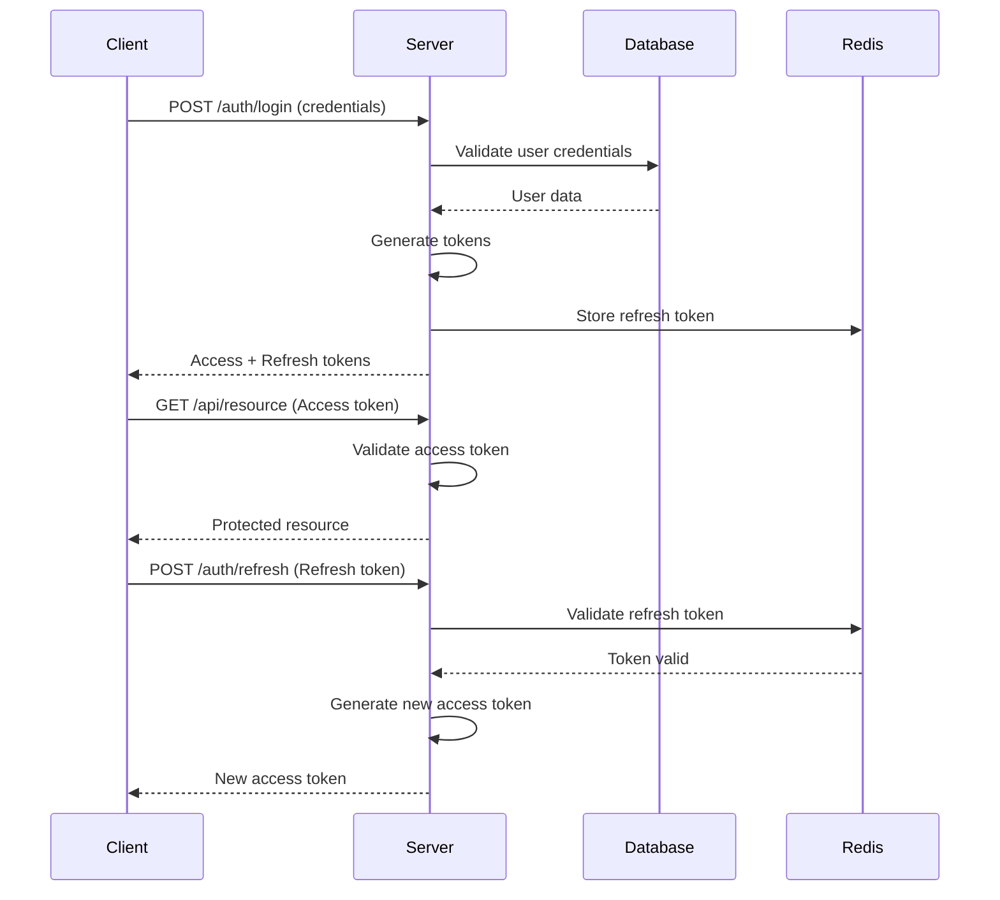

# 认证 (JWT)

## 概述

ACE NestJS Starter 实现了基于 JWT (JSON Web Token) 的认证系统，提供安全的用户身份验证和会话管理。

## 核心特性

- **双令牌机制**: Access Token + Refresh Token
- **安全存储**: HttpOnly Cookie 防止 XSS 攻击
- **自动刷新**: 无感知令牌续期
- **多设备支持**: 设备级别的会话管理
- **黑名单机制**: 支持令牌撤销

## 认证流程



## 实现细节

### JWT 策略配置

```typescript
// src/auth/strategies/jwt.strategy.ts
import { Injectable } from '@nestjs/common';
import { PassportStrategy } from '@nestjs/passport';
import { ExtractJwt, Strategy } from 'passport-jwt';
import { ConfigService } from '@nestjs/config';

@Injectable()
export class JwtStrategy extends PassportStrategy(Strategy) {
  constructor(private configService: ConfigService) {
    super({
      jwtFromRequest: ExtractJwt.fromAuthHeaderAsBearerToken(),
      ignoreExpiration: false,
      secretOrKey: configService.get('jwt.access.secret'),
    });
  }

  async validate(payload: any) {
    return {
      userId: payload.sub,
      email: payload.email,
      role: payload.role,
    };
  }
}
```

### 认证服务

```typescript
// src/auth/auth.service.ts
import { Injectable, UnauthorizedException } from '@nestjs/common';
import { JwtService } from '@nestjs/jwt';
import { PrismaService } from '@/prisma/prisma.service';
import { ConfigService } from '@nestjs/config';
import * as bcrypt from 'bcrypt';
import { v4 as uuidv4 } from 'uuid';

@Injectable()
export class AuthService {
  constructor(
    private prisma: PrismaService,
    private jwtService: JwtService,
    private configService: ConfigService,
    private redisService: RedisService,
  ) {}

  async validateUser(email: string, password: string) {
    const user = await this.prisma.user.findUnique({
      where: { email },
    });

    if (!user) {
      throw new UnauthorizedException('Invalid credentials');
    }

    const isPasswordValid = await bcrypt.compare(password, user.password);

    if (!isPasswordValid) {
      throw new UnauthorizedException('Invalid credentials');
    }

    const { password: _, ...result } = user;
    return result;
  }

  async login(user: any, deviceInfo?: DeviceInfo) {
    const payload = {
      sub: user.id,
      email: user.email,
      role: user.role,
    };

    const sessionId = uuidv4();

    const [accessToken, refreshToken] = await Promise.all([
      this.generateAccessToken(payload),
      this.generateRefreshToken({ ...payload, sessionId }),
    ]);

    // 存储刷新令牌到 Redis
    await this.redisService.set(
      `refresh_token:${user.id}:${sessionId}`,
      refreshToken,
      this.configService.get('jwt.refreshTtl'),
    );

    // 记录设备信息
    if (deviceInfo) {
      await this.saveDeviceInfo(user.id, sessionId, deviceInfo);
    }

    return {
      accessToken,
      refreshToken,
      expiresIn: this.configService.get('jwt.accessTtl'),
      tokenType: 'Bearer',
      user: {
        id: user.id,
        email: user.email,
        username: user.username,
        role: user.role,
      },
    };
  }

  async generateAccessToken(payload: any) {
    return this.jwtService.sign(payload, {
      secret: this.configService.get('jwt.access.secret'),
      expiresIn: this.configService.get('jwt.accessTtl'),
    });
  }

  async generateRefreshToken(payload: any) {
    return this.jwtService.sign(payload, {
      secret: this.configService.get('jwt.refresh.secret'),
      expiresIn: this.configService.get('jwt.refreshTtl'),
    });
  }

  async refreshToken(refreshToken: string) {
    try {
      const payload = this.jwtService.verify(refreshToken, {
        secret: this.configService.get('jwt.refresh.secret'),
      });

      // 验证 Redis 中的令牌
      const storedToken = await this.redisService.get(
        `refresh_token:${payload.sub}:${payload.sessionId}`,
      );

      if (!storedToken || storedToken !== refreshToken) {
        throw new UnauthorizedException('Invalid refresh token');
      }

      // 生成新的访问令牌
      const newAccessToken = await this.generateAccessToken({
        sub: payload.sub,
        email: payload.email,
        role: payload.role,
      });

      return {
        accessToken: newAccessToken,
        expiresIn: this.configService.get('jwt.accessTtl'),
        tokenType: 'Bearer',
      };
    } catch (error) {
      throw new UnauthorizedException('Invalid refresh token');
    }
  }

  async logout(userId: string, sessionId?: string) {
    if (sessionId) {
      // 登出特定设备
      await this.redisService.del(`refresh_token:${userId}:${sessionId}`);
    } else {
      // 登出所有设备
      const pattern = `refresh_token:${userId}:*`;
      const keys = await this.redisService.keys(pattern);
      if (keys.length > 0) {
        await this.redisService.del(...keys);
      }
    }

    return { message: 'Logged out successfully' };
  }

  async revokeToken(token: string) {
    // 将令牌加入黑名单
    const decoded = this.jwtService.decode(token) as any;
    const ttl = decoded.exp - Math.floor(Date.now() / 1000);

    if (ttl > 0) {
      await this.redisService.set(`blacklist:${token}`, '1', ttl);
    }
  }

  async isTokenBlacklisted(token: string): Promise<boolean> {
    const result = await this.redisService.get(`blacklist:${token}`);
    return result === '1';
  }
}
```

### 认证控制器

```typescript
// src/auth/auth.controller.ts
import {
  Controller,
  Post,
  Body,
  UseGuards,
  Request,
  HttpCode,
  HttpStatus,
  Headers,
} from '@nestjs/common';
import { AuthService } from './auth.service';
import { LoginDto, RegisterDto, RefreshTokenDto } from './dto';
import { LocalAuthGuard } from './guards/local-auth.guard';
import { JwtAuthGuard } from './guards/jwt-auth.guard';
import { Public } from './decorators/public.decorator';

@Controller('auth')
export class AuthController {
  constructor(private authService: AuthService) {}

  @Public()
  @Post('register')
  async register(@Body() dto: RegisterDto) {
    return this.authService.register(dto);
  }

  @Public()
  @UseGuards(LocalAuthGuard)
  @Post('login')
  @HttpCode(HttpStatus.OK)
  async login(
    @Request() req,
    @Headers('user-agent') userAgent: string,
    @Headers('x-device-id') deviceId: string,
  ) {
    const deviceInfo = {
      userAgent,
      deviceId: deviceId || 'default',
      ip: req.ip,
    };

    return this.authService.login(req.user, deviceInfo);
  }

  @Public()
  @Post('refresh')
  @HttpCode(HttpStatus.OK)
  async refresh(@Body() dto: RefreshTokenDto) {
    return this.authService.refreshToken(dto.refreshToken);
  }

  @UseGuards(JwtAuthGuard)
  @Post('logout')
  @HttpCode(HttpStatus.OK)
  async logout(@Request() req, @Headers('x-session-id') sessionId: string) {
    return this.authService.logout(req.user.userId, sessionId);
  }

  @UseGuards(JwtAuthGuard)
  @Post('logout-all')
  @HttpCode(HttpStatus.OK)
  async logoutAll(@Request() req) {
    return this.authService.logout(req.user.userId);
  }

  @UseGuards(JwtAuthGuard)
  @Get('profile')
  async getProfile(@Request() req) {
    return this.authService.getProfile(req.user.userId);
  }

  @UseGuards(JwtAuthGuard)
  @Post('change-password')
  @HttpCode(HttpStatus.OK)
  async changePassword(@Request() req, @Body() dto: ChangePasswordDto) {
    return this.authService.changePassword(req.user.userId, dto);
  }
}
```

### 守卫实现

```typescript
// src/auth/guards/jwt-auth.guard.ts
import { Injectable, ExecutionContext } from '@nestjs/common';
import { AuthGuard } from '@nestjs/passport';
import { Reflector } from '@nestjs/core';
import { IS_PUBLIC_KEY } from '../decorators/public.decorator';

@Injectable()
export class JwtAuthGuard extends AuthGuard('jwt') {
  constructor(private reflector: Reflector) {
    super();
  }

  canActivate(context: ExecutionContext) {
    const isPublic = this.reflector.getAllAndOverride<boolean>(IS_PUBLIC_KEY, [
      context.getHandler(),
      context.getClass(),
    ]);

    if (isPublic) {
      return true;
    }

    return super.canActivate(context);
  }

  handleRequest(err, user, info, context) {
    if (err || !user) {
      throw err || new UnauthorizedException('Unauthorized');
    }

    // 检查令牌是否在黑名单中
    const request = context.switchToHttp().getRequest();
    const token = this.extractTokenFromHeader(request);

    if (token) {
      const authService = request.app.get(AuthService);
      if (authService.isTokenBlacklisted(token)) {
        throw new UnauthorizedException('Token has been revoked');
      }
    }

    return user;
  }

  private extractTokenFromHeader(request: any): string | null {
    const [type, token] = request.headers.authorization?.split(' ') ?? [];
    return type === 'Bearer' ? token : null;
  }
}
```

## 高级功能

### 多因素认证 (MFA)

```typescript
// src/auth/mfa/mfa.service.ts
import { Injectable } from '@nestjs/common';
import * as speakeasy from 'speakeasy';
import * as qrcode from 'qrcode';

@Injectable()
export class MfaService {
  generateSecret(user: User) {
    const secret = speakeasy.generateSecret({
      name: `ACE App (${user.email})`,
      issuer: 'ACE NestJS',
    });

    return {
      secret: secret.base32,
      otpauthUrl: secret.otpauth_url,
    };
  }

  async generateQRCode(otpauthUrl: string) {
    return qrcode.toDataURL(otpauthUrl);
  }

  verifyToken(secret: string, token: string) {
    return speakeasy.totp.verify({
      secret,
      encoding: 'base32',
      token,
      window: 2,
    });
  }

  async enableMfa(userId: string, secret: string, token: string) {
    const isValid = this.verifyToken(secret, token);

    if (!isValid) {
      throw new BadRequestException('Invalid verification code');
    }

    await this.prisma.user.update({
      where: { id: userId },
      data: {
        mfaSecret: secret,
        mfaEnabled: true,
      },
    });

    // 生成备用码
    const backupCodes = this.generateBackupCodes();
    await this.saveBackupCodes(userId, backupCodes);

    return { backupCodes };
  }

  private generateBackupCodes(count = 10): string[] {
    return Array.from({ length: count }, () =>
      Math.random().toString(36).substr(2, 10).toUpperCase(),
    );
  }
}
```

### OAuth 社交登录

```typescript
// src/auth/strategies/google.strategy.ts
import { Injectable } from '@nestjs/common';
import { PassportStrategy } from '@nestjs/passport';
import { Strategy, VerifyCallback } from 'passport-google-oauth20';
import { ConfigService } from '@nestjs/config';

@Injectable()
export class GoogleStrategy extends PassportStrategy(Strategy, 'google') {
  constructor(
    private configService: ConfigService,
    private authService: AuthService,
  ) {
    super({
      clientID: configService.get('oauth.google.clientId'),
      clientSecret: configService.get('oauth.google.clientSecret'),
      callbackURL: configService.get('oauth.google.callbackUrl'),
      scope: ['email', 'profile'],
    });
  }

  async validate(
    accessToken: string,
    refreshToken: string,
    profile: any,
    done: VerifyCallback,
  ): Promise<any> {
    const { emails, photos, displayName } = profile;

    const user = await this.authService.validateOAuthUser({
      email: emails[0].value,
      username: displayName,
      avatar: photos[0].value,
      provider: 'google',
      providerId: profile.id,
    });

    done(null, user);
  }
}
```

### 会话管理

```typescript
// src/auth/session/session.service.ts
@Injectable()
export class SessionService {
  constructor(
    private redisService: RedisService,
    private prisma: PrismaService,
  ) {}

  async getUserSessions(userId: string) {
    const pattern = `session:${userId}:*`;
    const keys = await this.redisService.keys(pattern);

    const sessions = await Promise.all(
      keys.map(async (key) => {
        const data = await this.redisService.get(key);
        return JSON.parse(data);
      }),
    );

    return sessions.map((session) => ({
      id: session.id,
      deviceName: session.deviceName,
      lastActivity: session.lastActivity,
      ip: session.ip,
      userAgent: session.userAgent,
      current: session.current,
    }));
  }

  async terminateSession(userId: string, sessionId: string) {
    await this.redisService.del(`session:${userId}:${sessionId}`);
    await this.redisService.del(`refresh_token:${userId}:${sessionId}`);
  }

  async updateSessionActivity(userId: string, sessionId: string) {
    const key = `session:${userId}:${sessionId}`;
    const session = await this.redisService.get(key);

    if (session) {
      const data = JSON.parse(session);
      data.lastActivity = new Date();
      await this.redisService.set(key, JSON.stringify(data));
    }
  }
}
```

## 安全最佳实践

### 1. 密码策略

```typescript
// src/auth/validators/password.validator.ts
export class PasswordValidator {
  static validate(password: string): ValidationResult {
    const errors = [];

    if (password.length < 8) {
      errors.push('Password must be at least 8 characters');
    }

    if (!/[A-Z]/.test(password)) {
      errors.push('Password must contain uppercase letter');
    }

    if (!/[a-z]/.test(password)) {
      errors.push('Password must contain lowercase letter');
    }

    if (!/[0-9]/.test(password)) {
      errors.push('Password must contain number');
    }

    if (!/[!@#$%^&*]/.test(password)) {
      errors.push('Password must contain special character');
    }

    return {
      isValid: errors.length === 0,
      errors,
    };
  }

  static generateSecurePassword(): string {
    const chars =
      'ABCDEFGHIJKLMNOPQRSTUVWXYZabcdefghijklmnopqrstuvwxyz0123456789!@#$%^&*';
    let password = '';

    for (let i = 0; i < 16; i++) {
      password += chars.charAt(Math.floor(Math.random() * chars.length));
    }

    return password;
  }
}
```

### 2. 速率限制

```typescript
// src/auth/decorators/throttle.decorator.ts
export function AuthThrottle() {
  return applyDecorators(
    Throttle({
      default: {
        limit: 5,
        ttl: 60000, // 1 分钟内最多 5 次尝试
      },
    }),
  );
}

// 使用
@AuthThrottle()
@Post('login')
async login() {
  // ...
}
```

### 3. 账户锁定

```typescript
async handleFailedLogin(email: string) {
  const key = `failed_login:${email}`;
  const attempts = await this.redisService.incr(key);

  if (attempts === 1) {
    await this.redisService.expire(key, 900); // 15 分钟
  }

  if (attempts >= 5) {
    await this.lockAccount(email);
    throw new ForbiddenException('Account locked due to multiple failed attempts');
  }

  throw new UnauthorizedException(`Invalid credentials. ${5 - attempts} attempts remaining`);
}

async lockAccount(email: string) {
  await this.prisma.user.update({
    where: { email },
    data: {
      lockedUntil: new Date(Date.now() + 30 * 60 * 1000), // 锁定 30 分钟
    },
  });

  // 发送邮件通知
  await this.emailService.sendAccountLockNotification(email);
}
```

## 测试认证功能

```typescript
describe('AuthController (e2e)', () => {
  let app: INestApplication;
  let accessToken: string;
  let refreshToken: string;

  beforeAll(async () => {
    // 初始化测试应用
  });

  describe('/auth/register', () => {
    it('should register a new user', () => {
      return request(app.getHttpServer())
        .post('/auth/register')
        .send({
          email: 'test@example.com',
          username: 'testuser',
          password: 'Test123!@#',
        })
        .expect(201)
        .expect((res) => {
          expect(res.body).toHaveProperty('id');
          expect(res.body.email).toBe('test@example.com');
        });
    });
  });

  describe('/auth/login', () => {
    it('should login successfully', () => {
      return request(app.getHttpServer())
        .post('/auth/login')
        .send({
          email: 'test@example.com',
          password: 'Test123!@#',
        })
        .expect(200)
        .expect((res) => {
          expect(res.body).toHaveProperty('accessToken');
          expect(res.body).toHaveProperty('refreshToken');
          accessToken = res.body.accessToken;
          refreshToken = res.body.refreshToken;
        });
    });
  });

  describe('/auth/refresh', () => {
    it('should refresh access token', () => {
      return request(app.getHttpServer())
        .post('/auth/refresh')
        .send({ refreshToken })
        .expect(200)
        .expect((res) => {
          expect(res.body).toHaveProperty('accessToken');
          expect(res.body.accessToken).not.toBe(accessToken);
        });
    });
  });

  describe('/auth/profile', () => {
    it('should get user profile', () => {
      return request(app.getHttpServer())
        .get('/auth/profile')
        .set('Authorization', `Bearer ${accessToken}`)
        .expect(200)
        .expect((res) => {
          expect(res.body).toHaveProperty('email');
          expect(res.body.email).toBe('test@example.com');
        });
    });
  });
});
```

## 下一步

- [权限控制](./authorization.md) - RBAC 权限系统
- [安全最佳实践](./security.md) - 安全配置指南
- [OAuth 集成](./oauth.md) - 社交登录配置
