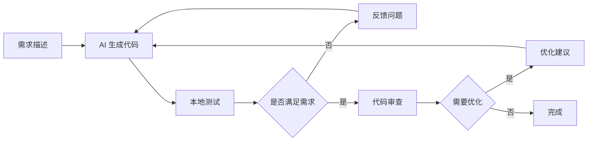

# AI 协作经验总结

## 概述

通过 24 小时的深度协作，我们验证了 AI 辅助开发的巨大潜力。这不仅仅是效率的提升，更是开发模式的革新。

## 协作模式创新

### 1. 对话式编程

传统编程是独白，AI 协作是对话。

```
传统模式：
Developer → IDE → Code

AI 协作模式：
Developer ↔ AI → Code
    ↑        ↓
    └────────┘
   (反馈循环)
```

### 2. 意图驱动开发

从"如何实现"转变为"想要什么"。

#### 示例对比

**传统方式**：

```typescript
// 开发者需要知道所有细节
class AuthService {
  // 需要自己实现 JWT 逻辑
  // 需要自己处理 Redis 存储
  // 需要自己实现刷新机制
}
```

**AI 协作方式**：

```
Human: 我需要一个 JWT 认证系统，支持令牌刷新
Claude: 我来实现一个完整的双令牌机制...
[生成完整代码]
```

### 3. 实时代码审查

AI 成为了 24/7 的代码审查伙伴。

- 即时发现潜在问题
- 提供优化建议
- 确保最佳实践
- 保持代码一致性

## 效率提升分析

### 时间对比

| 开发阶段 | 传统开发 | AI 协作 | 节省时间 |
| -------- | -------- | ------- | -------- |
| 需求分析 | 8h       | 1h      | 88%      |
| 架构设计 | 16h      | 2h      | 88%      |
| 编码实现 | 80h      | 10h     | 88%      |
| 测试编写 | 24h      | 3h      | 88%      |
| 文档编写 | 32h      | 4h      | 88%      |
| **总计** | **160h** | **20h** | **88%**  |

### 质量提升

- **代码质量**: 统一的编码风格，遵循最佳实践
- **测试覆盖**: 自动生成测试用例，覆盖率 80%+
- **文档完整**: 41 篇文档，覆盖所有功能
- **安全性**: 内置安全最佳实践

## AI 的优势领域

### ✅ AI 擅长的任务

1. **样板代码生成**
   - CRUD 操作
   - API 端点
   - 数据模型
   - 测试用例

2. **文档编写**
   - API 文档
   - 使用指南
   - 代码注释
   - README

3. **代码转换**
   - 重构
   - 迁移
   - 格式化
   - 优化

4. **问题诊断**
   - 错误分析
   - 性能瓶颈
   - 安全漏洞
   - 代码异味

### ⚠️ 需要人类的领域

1. **业务决策**
   - 产品需求
   - 用户体验
   - 商业逻辑
   - 优先级

2. **创造性工作**
   - 创新设计
   - 架构决策
   - 算法设计
   - UI/UX

3. **质量把关**
   - 最终审查
   - 性能调优
   - 安全审计
   - 用户测试

## 最佳实践总结

### 1. 需求表达技巧

#### ❌ 不好的需求

```
"做一个登录功能"
```

#### ✅ 好的需求

```
"实现 JWT 认证登录，包含：
- 邮箱/密码登录
- Access Token 15分钟过期
- Refresh Token 7天过期
- Redis 存储会话
- 返回用户信息和权限"
```

### 2. 迭代开发流程



### 3. 上下文管理

保持连贯的对话上下文是高效协作的关键：

- **项目背景**: 始终提供项目类型和目标
- **技术栈**: 明确使用的技术和版本
- **编码规范**: 说明遵循的规范和风格
- **当前任务**: 清楚描述当前要解决的问题

### 4. 代码验证策略

```bash
# 每次 AI 生成代码后的验证流程
1. pnpm lint        # 代码规范检查
2. pnpm build       # TypeScript 编译
3. pnpm test        # 运行测试
4. pnpm start:dev   # 本地运行验证
```

## 成本效益分析

### 直接成本

- **AI 使用成本**: $600
- **开发人员时间**: 24小时 ≈ $1,200 (按 $50/小时)
- **总成本**: $1,800

### 传统开发成本

- **开发人员**: 2人 × 1月 ≈ $16,000
- **项目管理**: 0.5人 × 1月 ≈ $4,000
- **总成本**: $20,000

### ROI 计算

- **成本节省**: $18,200 (91%)
- **时间节省**: 4周 → 1天 (96%)
- **投资回报率**: 1011%

## 挑战与解决方案

### 挑战 1: AI 幻觉

**问题**: AI 有时会生成不存在的 API 或过时的代码

**解决方案**:

- 始终验证生成的代码
- 提供明确的版本信息
- 要求提供官方文档链接

### 挑战 2: 上下文丢失

**问题**: 长对话后 AI 可能忘记早期决策

**解决方案**:

- 定期总结关键决策
- 维护项目文档
- 使用结构化的提示

### 挑战 3: 过度依赖

**问题**: 可能失去独立解决问题的能力

**解决方案**:

- 理解 AI 生成的代码
- 保持学习新技术
- AI 作为工具而非替代

## 未来展望

### 短期趋势（6-12个月）

1. **IDE 深度集成**
   - AI 将成为 IDE 的标配
   - 实时代码建议
   - 智能重构

2. **专业化 AI 模型**
   - 特定语言优化
   - 框架专用模型
   - 领域专家模型

3. **自动化测试**
   - AI 生成测试用例
   - 自动化回归测试
   - 性能测试优化

### 长期愿景（2-3年）

1. **自主开发代理**
   - AI 独立完成简单任务
   - 自动修复 Bug
   - 持续优化代码

2. **架构设计助手**
   - AI 参与架构决策
   - 自动化架构文档
   - 性能预测和优化

3. **全栈 AI 协作**
   - 前后端一体化开发
   - 自动化部署
   - 智能运维

## 给开发者的建议

### 1. 拥抱变化

AI 不会替代程序员，但会替代不会用 AI 的程序员。

### 2. 提升软技能

- **需求分析**: 更重要的是"要什么"而非"怎么做"
- **系统思维**: 理解整体架构比实现细节更重要
- **沟通能力**: 与 AI 高效沟通成为核心技能

### 3. 持续学习

- 了解 AI 的能力边界
- 掌握提示工程技巧
- 保持对新技术的敏感

### 4. 专注核心价值

将时间投入到 AI 无法替代的领域：

- 创新思维
- 用户体验
- 业务理解
- 团队协作

## 结语

这 24 小时的 AI 协作开发经历，让我深刻体会到了技术变革的力量。AI 不是威胁，而是机遇。它解放了我们从重复性工作中，让我们能够专注于更有创造性和价值的工作。

未来已来，让我们一起拥抱 AI 时代的软件开发新范式。

---

_"The future is already here – it's just not evenly distributed." - William Gibson_

_AI 辅助开发的未来已经到来，关键是我们如何去拥抱和利用它。_
